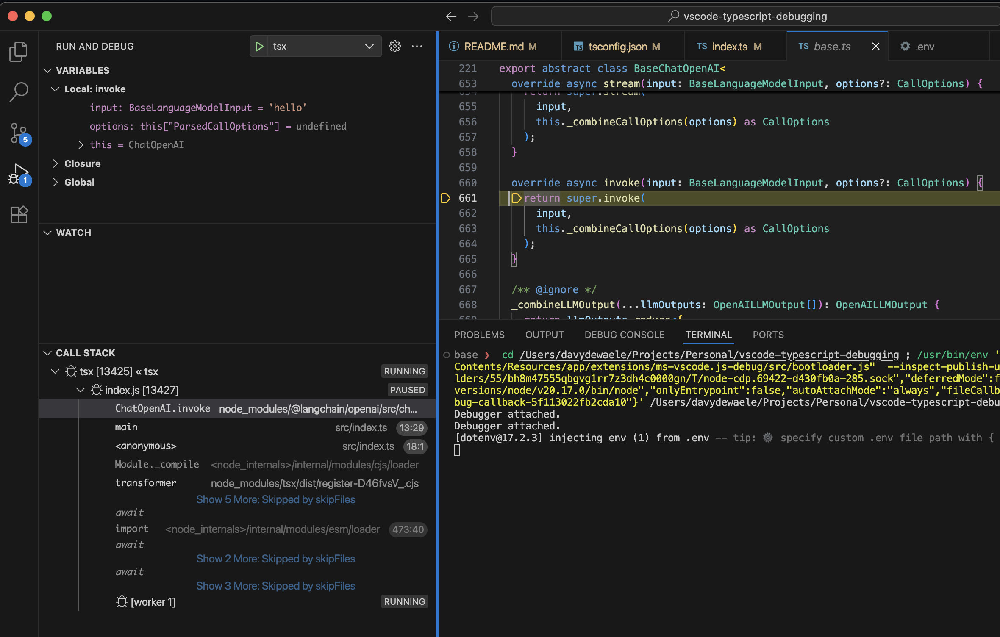

# VSCode Typescript Debugging

Simple typescript project to demonstrate typescript debugging in VSCode.

As you can see here, stepping into third party libraries should lead to us stepping into the typescript sources of thoese libraries providing everything is setup correctly.



# Projecr setup

There are 2 ways to create javascript / typescript projects.
Not going to go in 2 much details but in essence you have

- CommonJS (Original NodeJS convention)
- ESM (More recent ECMAScript language feature)

## CommonJS

CommonJS (CJS) is the module system invented by Node.
Focussed more on the server side as it was coming from the pure NodeJS world.
Considered "legacy" but still widely used and considered a reasonable default primarily for backwards compatability reasons.


### package.json

If you don't specify a `type` in your `package.json` it will default to `commonjs`
So most projects will be CommonJS projects. If ESM would become the default everything would break (tools / libraries / the internet)


### tsconfig.json

Here's the tsconfig.json will be using for the CommonJS version of our project.
Notice how we have a target ES2022. Don't confuse this with the CommonJS vs ESM discussion.
The target just dictates what javascript syntax features we can use.
As long as the module systems in tsconfig.json and package.json are compatible we are good to go.

```
{
    "compilerOptions": {
        "target": "ES2022",
        "module": "commonjs",
        "moduleResolution": "node",
        "strict": true,
        "skipLibCheck": true,
        "sourceMap": true,
        "outDir": "dist",
    },
    "include": [
        "src"
    ]
}
```

## ESM

ES Modules (ESM) is an official JavaScript feature defined in the ECMAScript spec
It is a lot broaster than the pure NodeJS CommonJS. ESM works in browsers , Node , Bun , Deno , ...
If we want to have an ESM version of our project we need to make a couple of changes


### package.json

Specify `type="module"` in your `package.json` as this is not the default.
You need to explicitely opt-in to ESM


### tsconfig.json

We'll be using NodeNext in our `tsconfig.json`.


```
{
    "compilerOptions": {
        "target": "ES2022",
        "module": "NodeNext",
        "moduleResolution": "NodeNext",
        "strict": true,
        "outDir": "dist",
        "sourceMap": true
    },
    "include": [
        "src"
    ]
}
```

## VSCode Launch Config

Now regardless of the type of typescript project you have, you're going to want to launch it in VSCode and have good debugging support.
For that we need a way to run our Typescript files.

There are 2 ways to go about it

- A multi-step approach where we first transpite into javascript and then use the raw node process to run the javascript
- A single step approach where we use a node loader to run the typescript directly.

TSX is one of those loaders.


### TSX

TSX allows you to run typescript files directly without a separate transipe step to javascrit.
According to the [TSX VSCode docs](https://tsx.is/vscode) you create a launch configuration that you can operate on the "current open file"

The launch config looks like this

```json
{
    "name": "tsx",
    "type": "node",
    "request": "launch",
    "program": "${file}",
    "runtimeExecutable": "tsx",
    "console": "integratedTerminal",
    "internalConsoleOptions": "neverOpen",
    "skipFiles": [
        "<node_internals>/**",
    ],
    "sourceMaps": true,
    "resolveSourceMapLocations": [
        "${workspaceFolder}/**",
    ],
},
```

- This assumes that `tsx` is available in your package.json.
- This will launch `tsx` on the currently opened file (just hit F5 and your debug session will start)
- It enables sourcemaps and provides a path where to resolve these source maps


1 small caveat :

Even you have `src/index.ts` open and you use the launch config, it will still use `dist/index.js` if such a file is present, meaning you could run outdated code if your `ts` and `js` are out of sync.

# References

- [VSCode copilot keyboard shortcuts](https://code.visualstudio.com/docs/copilot/reference/copilot-vscode-features)
- [Typescript tutorial](https://code.visualstudio.com/docs/typescript/typescript-tutorial)


